# TBeye UI 仕様書

## 目次

1. [はじめに](#はじめに)
2. [システム全体像](#システム全体像)
3. [画面ガイド](#画面ガイド)
   - [AI 議事録画面](#ai議事録画面)
   - [グループ選択画面](#グループ選択画面)
   - [グループ通話画面](#グループ通話画面)
   - [通話履歴画面](#通話履歴画面)
   - [リアルタイム状況画面](#リアルタイム状況画面)
   - [辞書・用語画面](#辞書用語画面)
   - [ユーザー管理画面](#ユーザー管理画面)
4. [よくある質問](#よくある質問)
5. [困ったときは](#困ったときは)
6. [用語集](#用語集)

---

## はじめに

### TBeye UI とは？

TBeye UI は、グループ通話の内容を**自動で文字起こし**し、**AI が申し送り記録を作成**するシステムです。

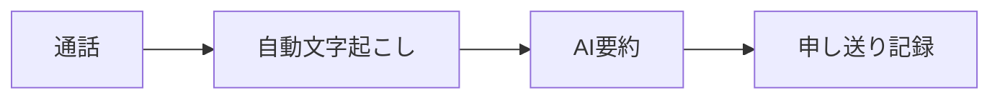

### こんな方におすすめ

| お悩み                           | TBeye UI で解決                    |
| -------------------------------- | ---------------------------------- |
| 毎日の申し送り作成に時間がかかる | AI が自動で申し送り記録を作成      |
| 通話内容を後から確認したい       | すべての通話が文字で記録される     |
| 聞き間違い・書き間違いが心配     | 音声から直接文字起こしするので正確 |
| 専門用語がうまく認識されない     | 辞書登録で認識精度を向上           |

### 日常業務の流れ

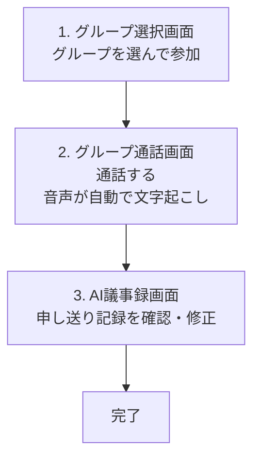

---

## システム全体像

### 画面の役割

| 画面             | 主な用途                 | 使う頻度   |
| ---------------- | ------------------------ | ---------- |
| AI 議事録        | 申し送り記録の確認・編集 | 毎日       |
| グループ選択     | 通話グループを選ぶ       | 毎日       |
| グループ通話     | 通話中の操作             | 毎日       |
| 通話履歴         | 過去の通話を検索         | 時々       |
| リアルタイム状況 | 子機の状態確認           | 時々       |
| 辞書・用語       | 認識精度の向上           | 初期設定時 |
| ユーザー管理     | ユーザーの追加・変更     | 管理者のみ |

---

## 画面ガイド

---

## AI 議事録画面

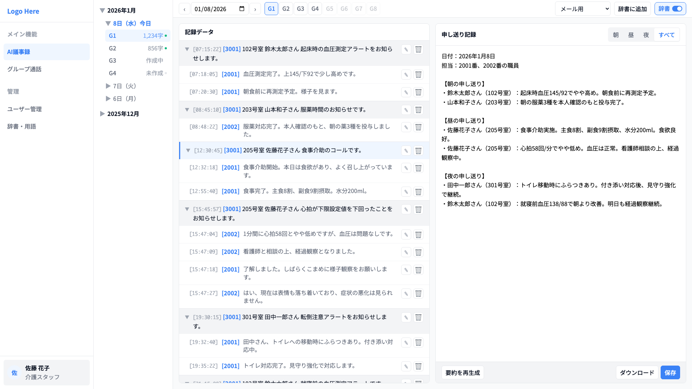

### この画面でできること

通話で話した内容が文字で表示され、AI が自動で「申し送り記録」を作成します。
間違いがあれば自分で修正できます。

### 画面の構成

| エリア             | 内容                                           |
| ------------------ | ---------------------------------------------- |
| 日付ツリー（左）   | 年月 → 日付 → グループの順に選んで議事録を表示 |
| 記録データ（中央） | 「誰が」「いつ」「何を言った」を時系列で表示   |
| 申し送り記録（右） | AI が作成した要約。朝・昼・夜でフィルタ可能    |

### 使い方

#### 申し送り記録を確認する

1. 左側の日付ツリーから「年月」→「日付」→「グループ」を選択
2. 中央に文字起こし結果、右側に申し送り記録が表示される
3. 朝・昼・夜・すべてのタブで時間帯を切り替え

#### 申し送り記録を修正する

**方法 1：申し送り記録を直接編集**（AI の要約を少し直したい場合）

1. 右側の申し送り記録エリアで編集したい箇所をクリック
2. テキストを修正
3. 保存ボタンをクリック

**方法 2：文字起こしを修正して再生成**（元の認識が間違っている場合）

1. 中央の記録データで間違っている発言を見つける
2. 編集ボタンをクリックして修正
3. 「要約を再生成」ボタンをクリック
4. AI が修正後のデータから新しい申し送り記録を作成

#### 辞書機能を切り替える

- 辞書 ON/OFF スイッチで、登録した用語を使うかどうかを切り替え
- ON にすると登録した用語が優先的に認識される

### 操作一覧

| 操作               | 説明                                     |
| ------------------ | ---------------------------------------- |
| 日付・グループ選択 | 左側のツリーから選んで議事録を表示       |
| タブ切り替え       | 朝・昼・夜・すべてで時間帯をフィルタ     |
| 文字起こし編集     | 各発言の編集ボタンで内容を修正           |
| 文字起こし削除     | 不要な発言を削除（ノイズ除去など）       |
| 申し送り記録編集   | AI の要約を直接修正                      |
| 要約を再生成       | 文字起こし修正後に押すと新しい要約を作成 |
| 辞書 ON/OFF        | 登録用語の使用を切り替え                 |

---

## グループ選択画面

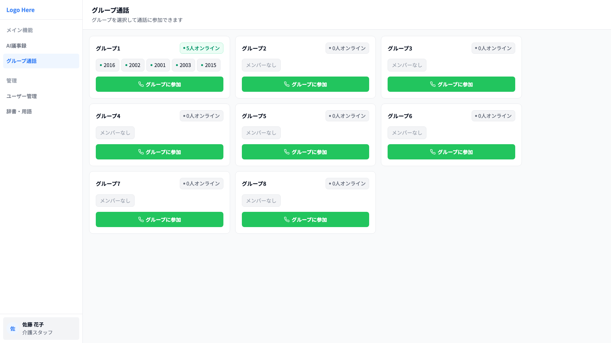

### この画面でできること

参加できるグループの一覧を見て、通話に参加できます。
各グループに何人がオンラインかも確認できます。

### 画面の構成

| エリア         | 内容                                             |
| -------------- | ------------------------------------------------ |
| グループカード | グループ名、オンライン人数、メンバー一覧を表示   |
| 参加ボタン     | 「グループに参加」ボタンでグループ通話画面へ移動 |

### 使い方

#### グループ通話に参加する

1. 参加したいグループのカードを探す
2. オンライン人数を確認（今通話中の人数がわかる）
3. 「グループに参加」ボタンをクリック
4. グループ通話画面に移動し、通話開始

> **ポイント**: 子機がなくても、PC のマイクとスピーカーで通話に参加できます

### 操作一覧

| 操作           | 説明                                 |
| -------------- | ------------------------------------ |
| グループ確認   | 各カードでグループ名とメンバーを確認 |
| オンライン確認 | 現在通話中の人数を確認               |
| グループに参加 | ボタンをクリックして通話画面へ       |

---

## グループ通話画面

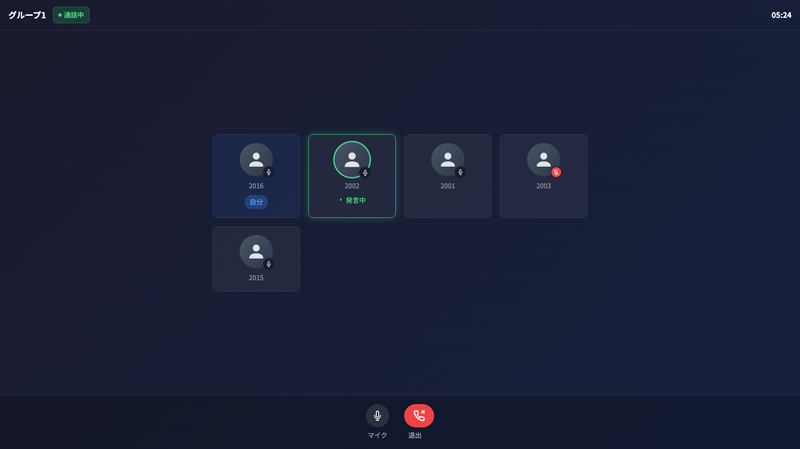

### この画面でできること

グループ通話中の操作を行います。
参加者の一覧と発言中の人がリアルタイムで表示されます。

### 画面の構成

| エリア       | 内容                                            |
| ------------ | ----------------------------------------------- |
| 通話ヘッダー | グループ名、通話状態（通話中/接続中）、経過時間 |
| 参加者一覧   | 各参加者のカード。発言中の人は緑色でハイライト  |
| 操作ボタン   | マイク ON/OFF、退出ボタン                       |

### 使い方

#### 通話中の操作

**マイクの切り替え**

- マイクボタンをクリックして ON/OFF 切り替え
- OFF にすると自分の声が相手に聞こえなくなる

**発言者の確認**

- 発言中の参加者は緑色でハイライト表示
- 誰が話しているか一目でわかる

**通話の終了**

- 退出ボタンをクリックして通話から離脱
- グループ選択画面に戻る

> **ポイント**: 通話中の音声は自動で文字起こしされ、後から AI 議事録画面で確認できます

### 操作一覧

| 操作          | 説明                                 |
| ------------- | ------------------------------------ |
| マイク ON/OFF | 自分の音声を出す/ミュートする        |
| 発言者確認    | 緑色のハイライトで発言中の人を確認   |
| 退出          | 通話を終了してグループ選択画面に戻る |

---

## 通話履歴画面

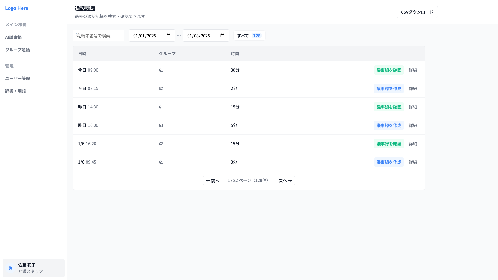

### この画面でできること

過去の通話記録を検索し、後から議事録を作成できます。
通話データを CSV でダウンロードすることもできます。

### 画面の構成

| エリア         | 内容                                   |
| -------------- | -------------------------------------- |
| 検索・フィルタ | 端末番号、日付範囲で絞り込み           |
| 通話一覧       | 日時、グループ、通話時間、議事録ボタン |

### 使い方

#### 過去の通話を検索する

1. 日付範囲を指定（例：先週の月曜〜金曜）
2. 必要に応じて端末番号で絞り込み
3. 該当する通話の一覧が表示される

#### 過去の通話から議事録を作成する

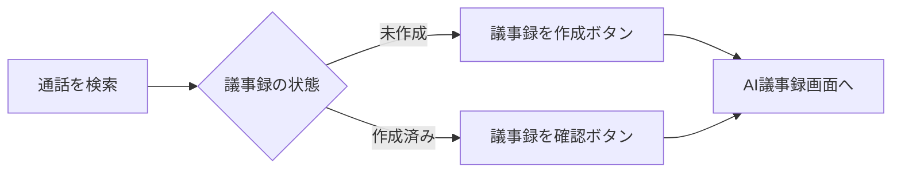

1. 議事録を作りたい通話を見つける
2. 「議事録を作成」ボタンをクリック（作成済みなら「議事録を確認」）
3. AI 議事録画面で生成された内容を確認

#### 通話データをダウンロードする

- CSV ダウンロードボタンで通話履歴をエクスポート
- Excel 等で開いて分析や報告に活用

### 操作一覧

| 操作             | 説明                                   |
| ---------------- | -------------------------------------- |
| 日付検索         | 日付範囲を指定して通話を絞り込み       |
| 端末検索         | 端末番号で特定の子機の通話を検索       |
| 議事録を作成     | 未作成の通話から議事録を生成           |
| 議事録を確認     | 作成済みの議事録を AI 議事録画面で表示 |
| CSV ダウンロード | 通話履歴をファイルで出力               |

---

## リアルタイム状況画面

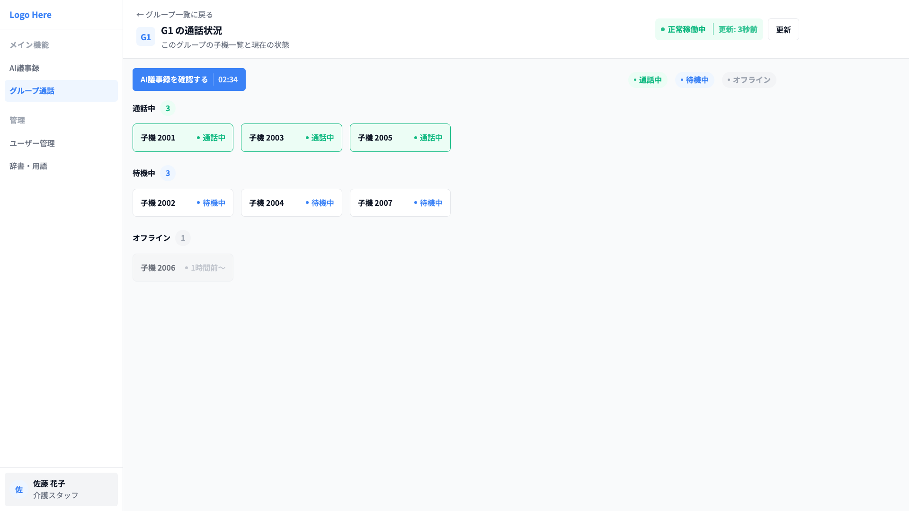

### この画面でできること

グループ内の子機の状態をリアルタイムで確認できます。
誰が通話中か、誰が待機中かが一目でわかります。

### 画面の構成

| エリア   | 内容                     |
| -------- | ------------------------ |
| 状態凡例 | 各色の意味を表示         |
| 子機一覧 | 各子機の番号と現在の状態 |

### 状態の見方

| 色     | 状態       | 意味                       |
| ------ | ---------- | -------------------------- |
| 緑     | 通話中     | グループ通話に参加している |
| 青     | 待機中     | 電源 ON、いつでも通話可能  |
| グレー | オフライン | 電源 OFF または接続なし    |

### 使い方

#### 子機の状態を確認する

1. リアルタイム状況画面を開く
2. 各子機の色で状態を確認
3. 必要に応じて更新ボタンで最新情報を取得

> **ポイント**: 「連絡が取れない」という時、この画面でオフラインかどうか確認できます

### 操作一覧

| 操作     | 説明                                       |
| -------- | ------------------------------------------ |
| 状態確認 | 各子機の色で通話中/待機中/オフラインを確認 |
| 手動更新 | 更新ボタンで最新の状態を取得               |

---

## 辞書・用語画面

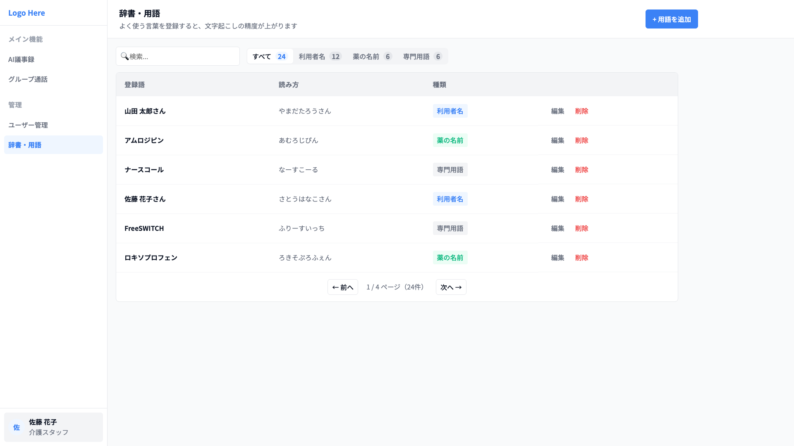

### この画面でできること

よく使う言葉を登録して、文字起こしの精度を上げることができます。
利用者名、薬の名前、専門用語などを登録しておくと正確に認識されます。

### 画面の構成

| エリア         | 内容                               |
| -------------- | ---------------------------------- |
| 検索・フィルタ | キーワード検索、カテゴリでフィルタ |
| 用語一覧       | 登録語、読み方、種類、操作ボタン   |

### 登録する用語の種類

| 種類     | 例                             | 効果                       |
| -------- | ------------------------------ | -------------------------- |
| 利用者名 | 山田太郎さん、佐藤花子さん     | 人名が正確に認識される     |
| 薬の名前 | アムロジピン、ロキソプロフェン | 薬品名の誤認識を防ぐ       |
| 専門用語 | ナースコール、バイタル         | 業界用語が正しく変換される |

### 使い方

#### 新しい用語を登録する

1. 「新しい用語を追加」ボタンをクリック
2. 登録したい言葉を入力（例：山田太郎）
3. 読み方を入力（例：やまだたろう）
4. 種類を選択（利用者名/薬の名前/専門用語）
5. 保存ボタンをクリック

#### 登録した用語を編集・削除する

- 各用語の編集ボタンで内容を修正
- 削除ボタンで用語を削除

> **ポイント**: 初期設定時にまとめて登録しておくと、日々の文字起こし精度が大幅に向上します

### 操作一覧

| 操作     | 説明                              |
| -------- | --------------------------------- |
| 新規追加 | 新しい用語を辞書に登録            |
| 編集     | 既存の用語を修正                  |
| 削除     | 不要な用語を削除                  |
| 検索     | キーワードで登録済み用語を検索    |
| フィルタ | 種類（利用者名/薬など）で絞り込み |

---

## ユーザー管理画面

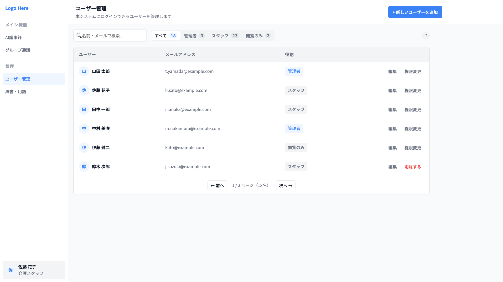

### この画面でできること

システムにログインできるユーザーを追加・編集・削除できます。
ユーザーごとに「何ができるか」の権限を設定します。

> **注意**: この画面は**管理者のみ**が使用できます

### 画面の構成

| エリア         | 内容                                 |
| -------------- | ------------------------------------ |
| 検索・フィルタ | 名前・メールで検索、役割でフィルタ   |
| ユーザー一覧   | ユーザー名、メール、役割、操作ボタン |

### 権限（役割）の種類

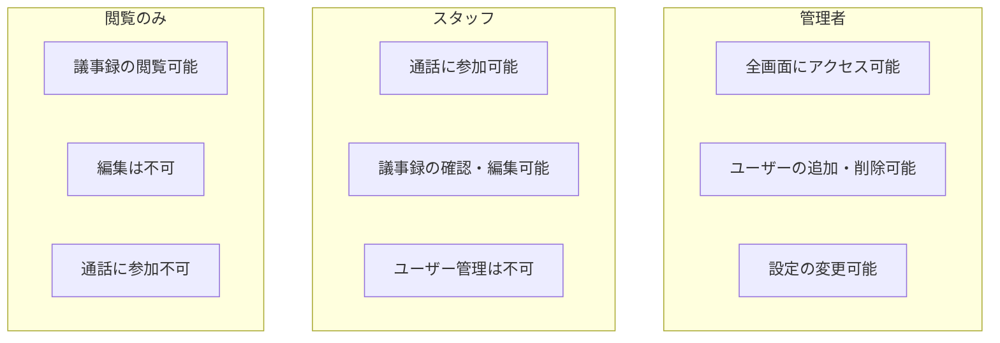

| 役割     | できること                   | できないこと   |
| -------- | ---------------------------- | -------------- |
| 管理者   | すべての機能                 | −              |
| スタッフ | 通話参加、議事録の確認・編集 | ユーザー管理   |
| 閲覧のみ | 議事録の閲覧                 | 編集、通話参加 |

### 使い方

#### 新しいユーザーを追加する

1. 「新しいユーザーを追加」ボタンをクリック
2. 以下の情報を入力：
   - 名前
   - メールアドレス
   - パスワード
   - 役割（管理者/スタッフ/閲覧のみ）
3. 保存ボタンをクリック

#### ユーザーの権限を変更する

1. 変更したいユーザーの編集ボタンをクリック
2. 役割のドロップダウンから新しい権限を選択
3. 保存ボタンをクリック

#### ユーザーを削除する

1. 削除したいユーザーの削除ボタンをクリック
2. 確認ダイアログで「削除」を選択

> **注意**: 削除したユーザーはログインできなくなります

### 操作一覧

| 操作         | 説明                             |
| ------------ | -------------------------------- |
| ユーザー追加 | 新しいユーザーを登録             |
| ユーザー編集 | 名前・メール・権限を変更         |
| ユーザー削除 | ユーザーを削除（ログイン不可に） |
| 検索         | 名前・メールでユーザーを検索     |
| フィルタ     | 役割で絞り込み表示               |

---

## よくある質問

### 文字起こしについて

**Q. 文字起こしが間違っていたらどうすればいい？**

2 つの方法があります：

| 状況                   | おすすめの方法                      |
| ---------------------- | ----------------------------------- |
| AI の要約だけ直したい  | 申し送り記録を直接編集して保存      |
| 元の認識が間違っている | 文字起こしを修正 → 「要約を再生成」 |

**Q. 特定の言葉がいつも間違って認識される**

→ 辞書・用語画面でその言葉を登録してください。次回以降、正確に認識されるようになります。

**Q. 辞書に何を登録すればいい？**

以下のような言葉を登録すると効果的です：

- 利用者のお名前（例：山田太郎さん）
- よく使う薬の名前（例：アムロジピン）
- 施設独自の用語や略語

---

### 通話について

**Q. PC から通話に参加できますか？**

はい、できます。グループ選択画面から参加すると、PC のマイクとスピーカーで通話できます。子機がなくても大丈夫です。

**Q. 通話中、自分の声を消したい**

マイクボタンをクリックして OFF にしてください。相手の声は聞こえますが、自分の声は相手に届きません。

---

### 議事録について

**Q. 議事録はいつ自動生成される？**

設定された時間（朝・昼・夜の申し送り時間）に自動で生成されます。

**Q. 過去の通話から議事録を作りたい**

通話履歴画面で該当の通話を検索し、「議事録を作成」ボタンをクリックしてください。

**Q. 議事録を作り直したい**

AI 議事録画面で「要約を再生成」ボタンをクリックすると、文字起こしデータから議事録を再作成します。

---

## 困ったときは

| 症状                       | 考えられる原因             | 対処法                               |
| -------------------------- | -------------------------- | ------------------------------------ |
| 文字起こしがされない       | マイクが OFF になっている  | グループ通話画面でマイクを ON にする |
| 議事録が生成されない       | まだ生成時間になっていない | 通話履歴から「議事録を作成」を実行   |
| 通話に参加できない         | ブラウザのマイク許可がない | ブラウザ設定でマイクを許可する       |
| 特定の言葉が認識されない   | 辞書に未登録               | 辞書・用語画面で登録する             |
| ユーザー管理画面が見えない | 権限が不足している         | 管理者に権限変更を依頼する           |
| 子機がオフラインのまま     | 電源 OFF or 圏外           | 子機の電源・電波状況を確認する       |

---

## 用語集

| 用語         | 意味                                                   |
| ------------ | ------------------------------------------------------ |
| 文字起こし   | 音声を自動的に文字に変換したもの                       |
| 申し送り記録 | AI が文字起こしを要約・整理した記録                    |
| 子機         | グループ通話用の携帯端末                               |
| 内線番号     | 各子機に割り当てられた識別番号                         |
| グループ     | 通話できるメンバーの集まり                             |
| 辞書         | 認識精度を上げるために登録する用語集                   |
| 役割（権限） | ユーザーが使える機能の範囲（管理者/スタッフ/閲覧のみ） |

---

_このドキュメントは TBeye UI の使い方を説明するものです。_
_ご不明な点がございましたら、管理者までお問い合わせください。_
